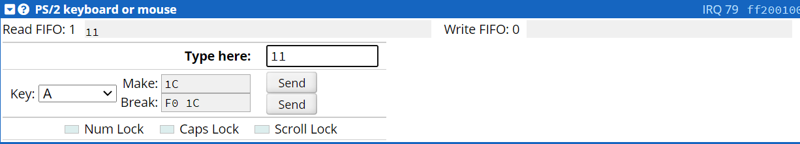
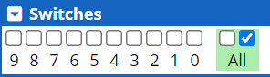
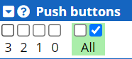
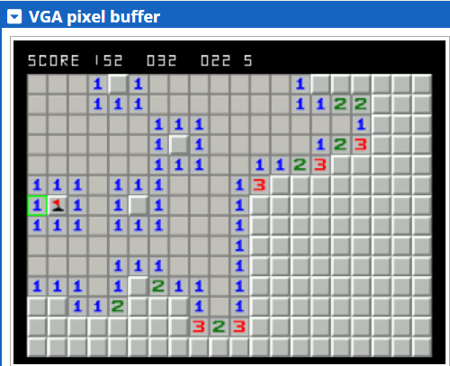
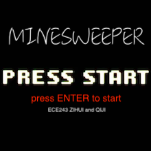
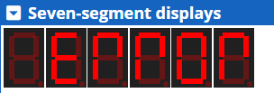

# ARM_Minesweeper
ECE 243 Final Course Project  
Created By: Mark Qi and Zihui Lu  
Professor: Jonathan Rose  

## Game Description
- Minesweeper is a singl-player puzzle video game. The objective is to clear a rectangular board containing hidden "mines" without detonating any of them. The player will gain hint regarding the location of the mines from the number of neighbouring mines in each field.  
- Microsoft Minesweeper was included in the standard install of Windows 3.1 in 1992.  

## Project Description
- ARM_Mineweeper is the final project for ECE 243 Winter 2022 at University of Toronto worth 5.6% of the total mark.  
- Using C as the predominant language to code the game and implemented on the DE1-SoC board.  
- The program can also be simulated using an online tool called CPUlator, which can be assessed at https://cpulator.01xz.net/?sys=arm-de1soc.  

## Our Game
- Board Size: 14 Rows By 20 Columns  
- Bomb Number: Randomized using srand, approximately one mine per eight squares  
- Win Condition: Flag every single mines or explore all other squares  
- Lose Condition: If selected a position containing a mine, the game is lost  
- The Number Of Surrounding Mines At Any Position Will Be Displayed  

   

## Input Control (PS/2 Keyboard)
- Using PS/2 Keyboard Input On The DE1-SoC Board  

   

### Input Methods (Single Key)
*- Key S: Select The Location Player Want To Explore*  
*- Key F: Flag The Location Player Think Contain A Mine*  
*- Arrow Up: Move One Location Up, and Highlight The Location*  
*- Arrow Down: Move One Location Down, and Highlight The Location*  
*- Arrow Left: Move One Location Left, and Highlight The Location*  
*- Arrow Right: Move One Location Right, and Highlight The Location*  
### Exact Coordinate (Multiple Keys)
#### Column Position (First Step)
*- The Two Digit Coordinate For The Column You Wanted Seperated By Key C*
#### Seperation (Second Step)
*- Separate The Column Position And Row Position By A Single Space Key*
#### Row Position (Third Step)
*- The Two Digit Coordinate For The Column You Wanted Seperated By Key C*
#### Final Step
*- Press Enter And The Player Has Successfully Selected A Position To Check To Flag*  
*- The Input Should Look Something Like #c# 'space' #c# 'enter', where # are digit from 0 - 9*

## Input Control (SW)
- Using The Mechanical Switches On The DE1-SoC Board  

   

### Input Methods
*- When The SW Is Not ALL Zero, The Game Will Automatically Restart When Lost Or Win*  
*- When The SW Is Not ALL Zero, When The Player Select A Place With Mine, It Will Flag The Position*  

## Input Control (KEY / Push Buttons)
- Using The Mechanical Push Buttons On The DE1-SoC Board  

   

### Input Methods
*- Pressing Any One Of The Four Push Buttons Will Cause The Game To Terminate*  

## Output (VGA Display)
- A 320 By 240 Pixel VGA Display Is Implemented On The DE1-SoC Board  
- All Important Information Regarding Gameplay Is Display On It  

   

- The Top Row From Left To Right Are Sequentially The Score, Number Of Mines Left, Time Passed In Seconds  

- When The Game First Start, You Will See  
- If You Press Enter, The Game Will Start  

   

- When You Win, You Will See  

   

- When You Lose, You Will See  

   

## Output (LED)
- There are a total of 10 LEDs on the DE1-SoC board, they will be showing keyboard input in binary  

   

## Output (Seven Segment Displays)
- There are six seven segment displays that will indicate when an incorrect input has been entered  

   

## Conclusion
- Overall, this was a fun project and the implementation of minesweeper on the DE1-SoC board were very successful  
